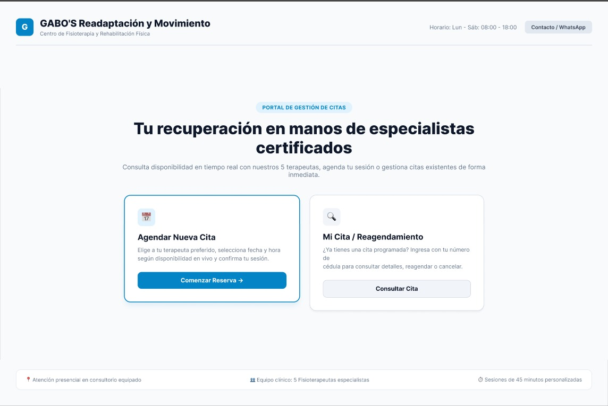
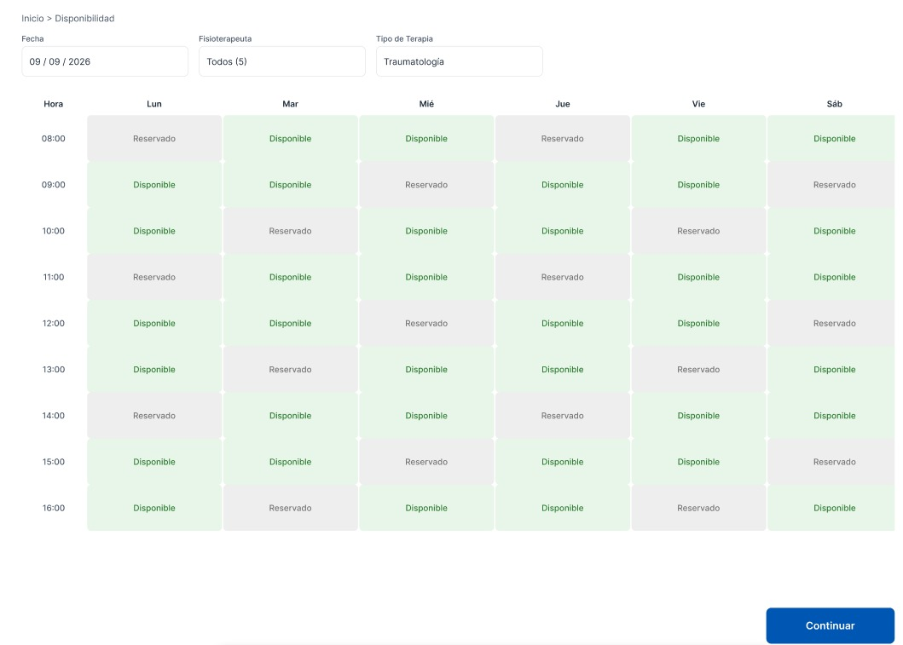
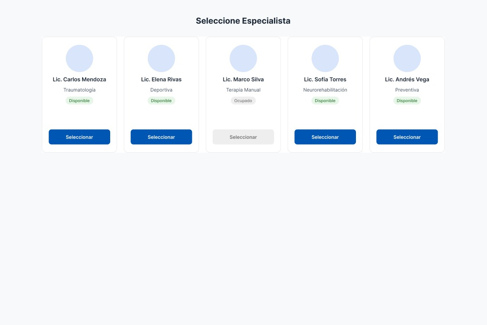
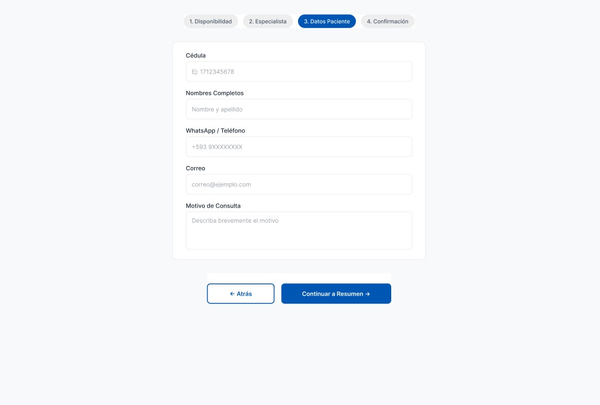
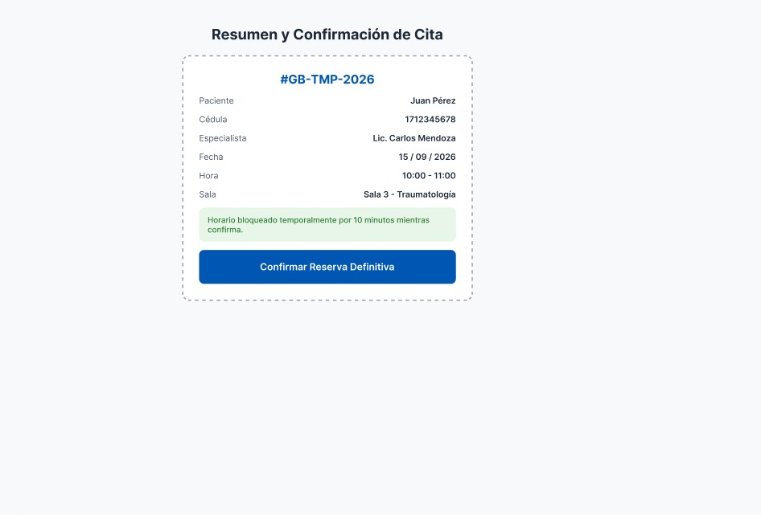
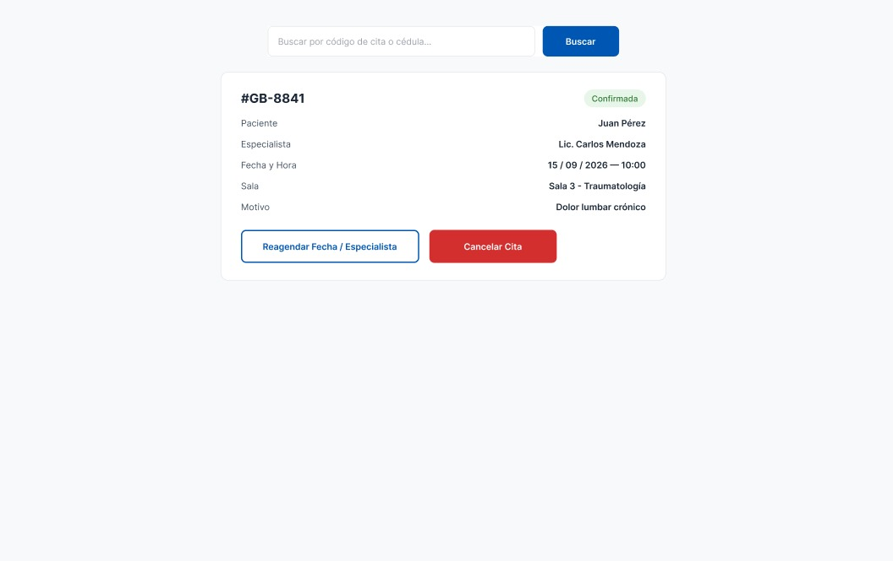
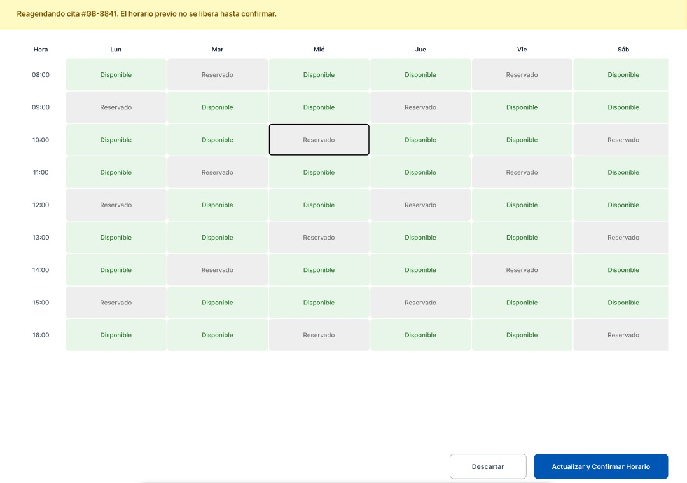
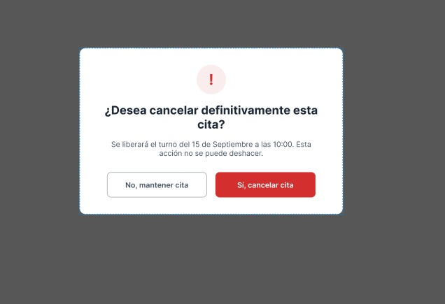

# Prototipo Interactivo Navegable (Figma / Penpot) — GABO'S Readaptación y Movimiento

**Responsable:** Lozada Marcial Pablo Damián ([@Idk-Damian](https://github.com/Idk-Damian))  
**Artefacto:** Actividad 6 — Prototipado Interactivo  
**Ruta del Artefacto:** `04-prototipo-figma/prototipo-interactivo.md`  
**Rama de trabajo:** `feature/prototipo-hci`  
**Issue Relacionado:** [#4](https://github.com/Jonathan305g/Prueba_01_IHC/issues/4)  

---

## 1. Introducción y Enlace Público

Este documento consolida la arquitectura y especificación HCI del prototipo interactivo de fidelidad media/alta desarrollado en Figma para el centro de rehabilitación **GABO'S Readaptación y Movimiento**.

- 🔗 **Enlace navegable en Figma (Permisos abiertos):** [Prototipo Interactivo GABO'S](https://www.figma.com/proto/gabo-salud-ihc/GABOS-Gestion-Citas-Prototipo)
- 📁 **Documento de enlaces y mapa de capturas:** [`docs/04_prototipo/figma_links.md`](../docs/04_prototipo/figma_links.md)

---

## 2. Descripción de los 8 Flujos y Pantallas Obligatorias

### 1️⃣ Pantalla 1 — Inicio de Gestión
- **Objetivo:** Ofrecer una entrada clara al portal dividiendo la intención del usuario en dos caminos directos.
- **Elementos clave:** Header institucional, horario de atención, botón primario *"Comenzar Reserva"* y botón secundario *"Mi Cita / Reagendamiento"*.
- **Captura visual:**
  

### 2️⃣ Pantalla 2 — Consulta de Disponibilidad (Grilla Semanal)
- **Objetivo:** Permitir la visualización global e inmediata de cupos libres por hora y día de la semana.
- **Elementos clave:** Barra de filtros (Fecha, Fisioterapeuta "Todos (5)", Tipo de terapia "Traumatología"), grilla visual con celdas *"Disponible"* (verde suave) y *"Reservado"* (gris tenue).
- **Captura visual:**
  

### 3️⃣ Pantalla 3 — Selector de los 5 Fisioterapeutas
- **Objetivo:** Facilitar la elección explícita de especialista según área de especialización y estado actual.
- **Elementos clave:** Tarjetas individuales para los 5 fisioterapeutas (Lic. Carlos Mendoza, Lic. Elena Rivas, Lic. Marco Silva, Lic. Sofía Torres, Lic. Andrés Vega).
- **Captura visual:**
  

### 4️⃣ Pantalla 4 — Formulario de Captura de Datos del Paciente
- **Objetivo:** Recopilar datos mínimos indispensables de identificación y contacto sin sobrecargar al usuario.
- **Elementos clave:** Indicador de ruta superior (Paso 3: Datos Paciente), campos para Cédula, Nombres Completos, WhatsApp/Teléfono (+593), Correo y Motivo de consulta.
- **Mecanismo de reversibilidad:** Botón *"← Atrás"* que permite regresar al selector de especialista manteniendo los datos ingresados en el formulario.
- **Captura visual:**
  

### 5️⃣ Pantalla 5 — Resumen y Confirmación de Cita
- **Objetivo:** Brindar visibilidad del estado temporal pre-reserva e impedir solapamiento por concurrencia.
- **Elementos clave:** Tarjeta tipo recibo provisional con código temporal (`#GB-TMP-2026`), bloque de bloqueo temporal por 10 minutos en verde menta, y botón primario *"Confirmar Reserva Definitiva"*.
- **Captura visual:**
  

### 6️⃣ Pantalla 6 — Detalle de Cita Existente
- **Objetivo:** Presentar el comprobante definitivo de una cita agendada accesible mediante búsqueda por cédula o folio.
- **Elementos clave:** Folio definitivo (`#GB-8841`), estado en badge verde (*Confirmada*), datos completos de sesión (Fecha, Hora, Sala 3 - Traumatología, Motivo), y botones de acción: *"Reagendar Fecha / Especialista"* y *"Cancelar Cita"*.
- **Captura visual:**
  

### 7️⃣ Pantalla 7 — Flujo de Reagendamiento
- **Objetivo:** Cambiar el horario de una cita existente previniendo pérdida involuntaria del turno original.
- **Elementos clave:** Banner superior informativo en amarillo (*"Reagendando cita #GB-8841. El horario previo no se libera hasta confirmar"*), selección de nuevo cupo en grilla y botones de confirmación/descarte.
- **Captura visual:**
  

### 8️⃣ Pantalla 8 — Diálogo Destructivo de Cancelación
- **Objetivo:** Prevenir eliminaciones accidentales de citas mediante confirmación en dos pasos.
- **Elementos clave:** Modal emergente centrado sobre fondo oscurecido (overlay), ícono de advertencia `!`, mensaje claro (*"¿Desea cancelar definitivamente esta cita? Se liberará el turno del 15 de Septiembre a las 10:00. Esta acción no se puede deshacer"*), botón secundario *"No, mantener cita"* y botón destructivo rojo *"Sí, cancelar cita"*.
- **Captura visual:**
  

---

## 3. Integración de Navegación Reversible y Prevención de Errores

1. **Persistencia de datos en la navegación hacia atrás:** Al presionar *"← Atrás"* en el Paso 3 (Formulario del paciente), el sistema preserva los datos de Cédula, Nombres y Teléfono ya ingresados si el usuario desea revisar o cambiar la elección del especialista.
2. **Reserva temporal con temporizador:** El paso 5 congela el cupo durante 10 minutos para evitar colisiones de concurrencia mientras el usuario revisa sus datos.
3. **Reagendamiento seguro (Atomisidad):** El cupo original (`#GB-8841`) no se elimina del sistema hasta que la nueva fecha sea confirmada explícitamente.

---

## 4. Estados del Sistema (Feedback Visual e Informativo)

| Estado | Manifestación Visual / Comportamiento | Propósito HCI |
|---|---|---|
| **Carga (Loading)** | Spinners y skeletons animados en botones y grillas de horarios | Informar que la verificación de disponibilidad está en curso |
| **Éxito** | Badges de confirmación verde y comprobante generado `#GB-8841` | Proporcionar cierre claro de la transacción |
| **Error (Conflicto)** | Alert banner explicativo cuando un horario fue tomado por otro usuario justo antes | Explicar la causa del problema y sugerir horarios alternativos inmediatos |
| **Recuperación** | Opción de reintentar búsqueda o restaurar datos del borrador | Permitir al usuario corregir errores sin reiniciar todo el proceso |

---

## 5. Principios de Accesibilidad Aplicados (WCAG 2.1)

- **Contraste de color adecuado:** Cumplimiento de relación de contraste superior a 4.5:1 (Azul primario `#0056B3` sobre fondo blanco `#FFFFFF`, Rojo destructivo `#D93025`).
- **Etiquetas legibles e indicación del estado:** Los estados de la agenda (*Disponible* vs *Reservado* vs *Ocupado*) combinan texto descriptivo, bordes diferenciados e íconos, sin depender únicamente del color.
- **Soporte de navegación asistida:** Estructura jerárquica de encabezados (H1, H2, H3), áreas de toque amplias (mínimo 44x44px) y soporte para navegación por teclado (focus visible con anillo azul).

---

## 6. Alineación con las Metáforas de Interfaz (Actividad 5)

- **Metáfora Organizacional (Casillero por terapeuta):** Reflejada en la Pantalla 3 donde cada fisioterapeuta posee su propia tarjeta/contenedor de agenda.
- **Metáfora de Navegación (Ruta con hitos):** Reflejada en la barra de progreso superior de 4 pasos (*1. Disponibilidad → 2. Especialista → 3. Datos Paciente → 4. Confirmación*).
- **Metáfora Funcional (Comprobante / Ticket):** Reflejada en las Pantallas 5 y 6 mediante tarjetas de resumen estilizadas con folio y borde punteado simulando un recibo físico.
