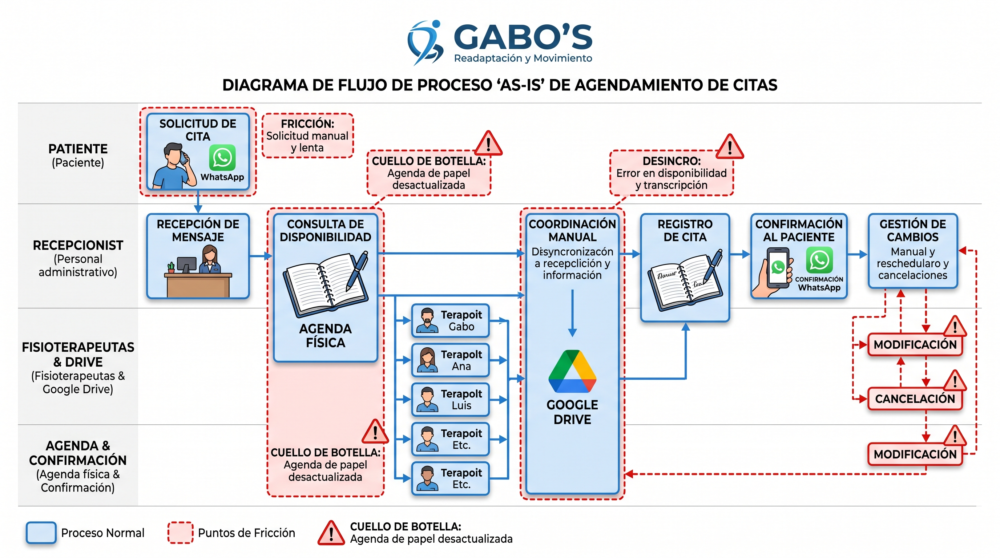

# Diagnóstico de Situación y Usuarios — Caso GABO'S Readaptación y Movimiento

## Actividad 1: Análisis del Proceso Actual (Flujo AS-IS)

### Diagrama del Flujo de Proceso AS-IS
 

### 1. Modelado del Flujo Actual Paso a Paso
1. **Solicitud:** El paciente envía un mensaje por WhatsApp solicitando atención o disponibilidad.
2. **Recepción y consulta:** La recepcionista revisa los chats y consulta manualmente la libreta/agenda física de papel.
3. **Coordinación cruzada:** En caso de dudas, el personal interrumpe la sesión de uno de los 5 fisioterapeutas o busca historias clínicas aisladas en Google Drive.
4. **Confirmación y registro:** La recepcionista anota con lápiz/esfero en la agenda física y redacta un mensaje asíncrono de confirmación por WhatsApp.
5. **Gestión de cancelaciones/cambios:** Se tacha o borra manualmente en la libreta física y se reanuda el ciclo de mensajes.

### 2. Puntos de Fricción, Tiempos Muertos y Transcripciones Redundantes
* **Tiempos muertos:** Asincronía prolongada entre la consulta del paciente y la confirmación final del turno.
* **Transcripciones redundantes:** Datos personales se copian a mano desde el chat a la agenda física, y de ahí se redactan informes clínicos en Google Drive sin sincronización.
* **Colisiones de agenda:** Alto riesgo de asignación doble de turnos para un mismo especialista entre los 5 fisioterapeutas del centro.

### 3. Problemas de Principios HCI
* **Visibilidad del estado del sistema:** Ni el paciente ni los especialistas tienen acceso a la disponibilidad en tiempo real.
* **Retroalimentación (Feedback):** Nula respuesta de confirmación inmediata al enviar la solicitud.
* **Consistencia:** Discrepancias constantes entre lo acordado por WhatsApp, lo registrado en papel y los archivos en Google Drive.

### 4. Factores Humanos y Tecnológicos
* **Factores Humanos:**
  1. Sobrecarga cognitiva por atención simultánea de llamadas, mensajes y registro manual.
  2. Fallas en la memoria de trabajo que derivan en olvidos de cancelaciones o anotaciones cruzadas.
* **Factores Tecnológicos:**
  1. Asincronía de canales desconectados (WhatsApp sin integración con bases de datos).
  2. Ausencia de persistencia y concurrencia multiusuario (agenda de papel mono-acceso y sin respaldos).
